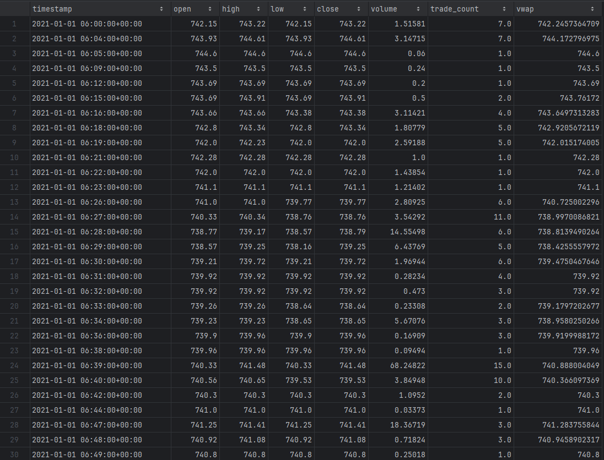
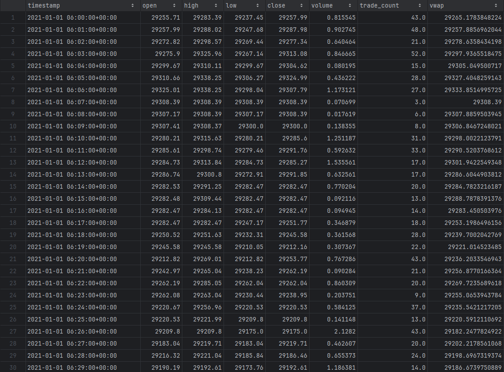
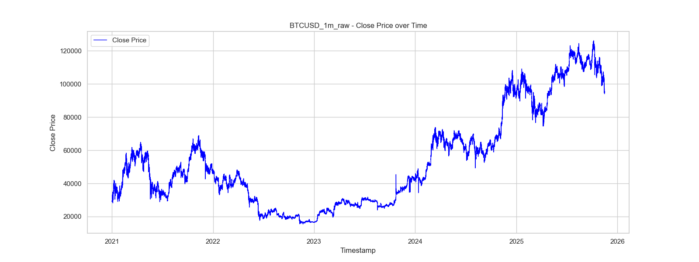
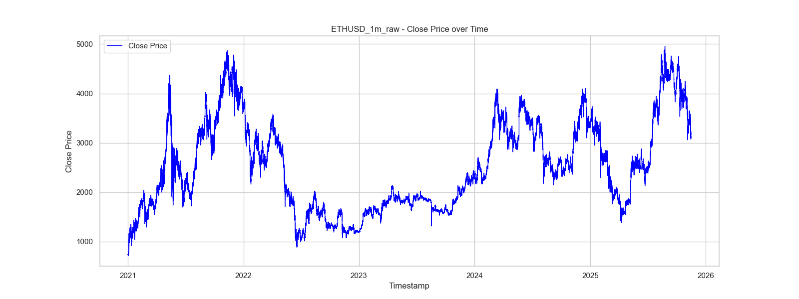
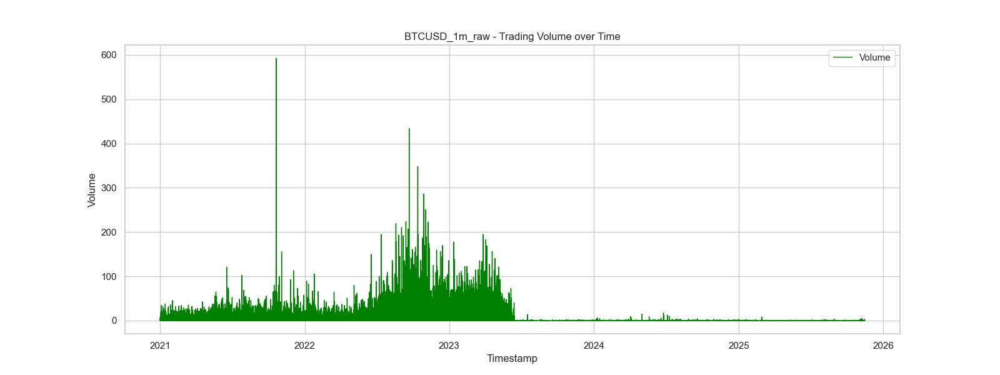
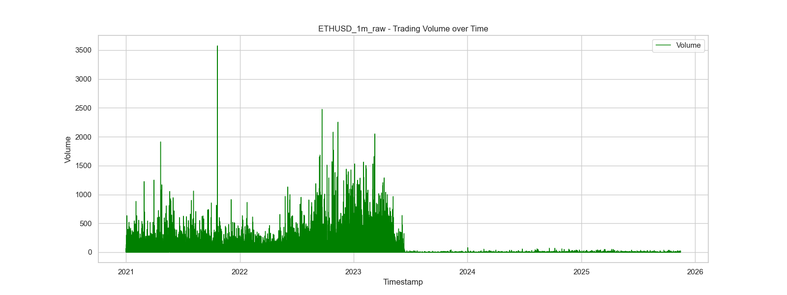
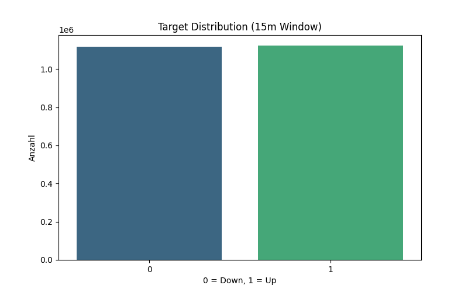
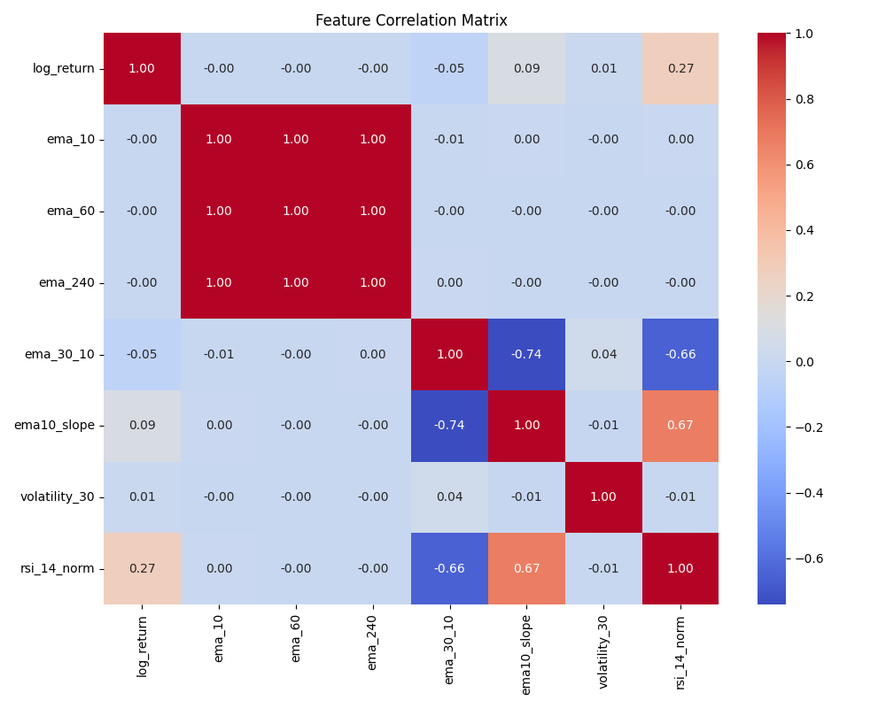

# Experiment 1

### Problem Definition:
**Target**

Vorhersage, ob der Preis von BTC/USD in den nächsten t = [5, 10, 15, 30, 60, 120, 240] Minuten steigt oder fällt in einem Zeitraum vom 01.01.2021 bis 15.11.2025
Dazu wird der Trend berechnet durch:
- lineare Regression des zukünftigen Preisfensters
- Normalisierung des Slopes durch den Durchschnittspreis
- binäre Label:
1 = Trend nach oben,
0 = Trend nach unten

Damit handelt es sich um ein Short-Term Crypto Trend Prediction Problem.

**Input Features**

Wir verzichten bewusst auf unnötig viele Indikatoren und konzentrieren uns auf wenige, erklärbare Features. Wenn wir uns sicherer fühlen, erweitern wir es natürlich.

Preisbasierte Features
- Normalisierte Close-Preise
- Log-Returns über 1 Minute

Trend-Features
- Normalisiertes exponential moving average (EMA) von t=[5, 10, 15, 20, 30, 60, 120, 240] minuten
- EMA-Differenz (Trendrichtung)
- Slope von EMA (Trendschärfe)

Volumen-Feature
- Normalisiertes Volumen

## Procedure Overview:

- Sammeln von 1-Minute OHLCV-Daten der Kryptowährungen BTC/USD und ETH/USD über die Alpaca Crypto API für den Zeitraum 01.01.2021 – 15.11.2025.
- Berechnung der Features: normalisierte Close-Preise, Log-Returns, EMAs (t = 5, 10, 15, 20, 30, 60, 120, 240 Minuten), EMA-Differenzen (z. B. EMA30 – EMA10), Slope von EMA und normalisiertes Handelsvolumen.
- Erstellung der Zielvariable für verschiedene Zeitfenster t ∈ {5, 15, 30, 60 Minuten}, die angibt, ob der Kurs steigt (1) oder fällt (0).
- Training eines neuronalen Netzwerks auf Basis dieser Features zur Vorhersage der kurzfristigen Trendrichtung (binäre Klassifikation) und Evaluation mittels zeitbasierter Train-/Validation-/Test-Splits.
- Optionales Backtesting der Modellvorhersagen in einer simplen Trading-Strategie: Long-Positionen bei positiven Trendvorhersagen eröffnen und für die jeweilige Dauer t halten.

---

### Data Acquisition

Extrahiert Rohdaten für BTC/USD und ETH/USD von der Alpaca Crypto API.

**Script**

[scripts/01_data_acquisition/crypto_data_acquisition.py](scripts/01_data_acquisition/crypto_data_acquisition.py)

Ruft 1-Minuten Daten von 2021-01-01 bis 2025-11-15 ab jeweils für BTC/USD und ETH/USD und speichert sie als .csv sowie .parquet Dateien in:
[data](data)

Beispiel für ETH/USD Daten:

Beispiel für BTC/USD Daten:

---

### Data Understanding
Visualisiert die Kursentwicklung und das Handelsvolumen von BTC und ETH und untersucht erste Eigenschaften wie auch Gemeinsamkeiten der Daten.

**Script**  

[02_crypto_data_understanding.py](scripts/02_data_understanding/02_crypto_data_understanding.py)

**Plots**  

**Erste Erkenntnisse**

- Die Close-Preise von BTC und ETH zeigen typische kurzfristige Schwankungen im Minutenbereich, wobei BTC tendenziell höhere Preisniveaus aufweist.
- Das Handelsvolumen variiert stark über die Zeit und zeigt Spitzen zu bestimmten Handelszeiten.
- BTC und ETH weisen teilweise ähnliche Bewegungsmuster auf, was auf eine gewisse Korrelation im Marktverhalten hinweist.

---

### Pre-Split Preparation
Berechnet alle Features und Targets aus den Rohdaten, die später in das Modell eingehen

**Script**

[crypto_data_preparation.py](scripts/03_pre_split_prep/crypto_data_preparation.py)

**Features** berechnet:
- Normalisierte Close-Preise
- Log-Returns über 1 Minute
- EMAs (t = 5, 10, 15, 20, 30, 60, 120, 240 Minuten)
- EMA-Differenzen (z. B. EMA30 – EMA10)
- Slope von EMA
- Rolling Volatility (t = 30 Minuten)
- RSI (Relative Strength Index, t = 14 Minuten)

**Targets** berechnet:
- Binäre Labels für t = [5, 10, 15, 30, 60, 120, 240] Minuten
- 1 = Trend nach oben (positiver Slope)
- 0 = Trend nach unten (negativer Slope)
- Trend wird berechnet mittels linearer Regression der Close-Preise des zukünftigen Zeitfensters t 

**Warum diese Features?**

- Vergleichbarkeit: Absolute Preise (z.B. 20.000$ vs 60.000$) verwirren das Modell. Wir nutzen Log-Returns (prozentuale Änderungen), damit alle Datenpunkte vergleichbar bleiben.

- Rauschen filtern: Minuten-Charts sind sehr chaotisch. EMAs (gleitende Durchschnitte) glätten den Kurs, um den echten Trend sichtbar zu machen.

- Marktpsychologie (RSI): hilft dem Modell zu erkennen, ob der Markt "überkauft" oder "überverkauft" ist – wichtige Signale für Trendwenden.

- Risiko (Volatilität): "Nervösität" des Marktes messen. Das Modell lernt so, zwischen ruhigen Phasen und explosiven Ausbrüchen zu unterscheiden.

- Normalisierung: Wir skalieren alle Werte auf eine ähnliche Größe (Z-Score), damit das neuronale Netz schneller lernt.

**Technische Umsetzung**

Speed: Statt 2,5 Millionen Zeilen einzeln zu berechnen (was Stunden dauert), nutzen wir Vektorisierung. Damit werden alle Berechnungen gleichzeitig ausgeführt (Dauer: wenige Sekunden).

**Ergebnisse der Datenanalyse (Findings)**

Balance: 
- Es gibt fast genau gleich viele "Up"- wie "Down"-Phasen (50/50 Verteilung). Das ist ideal, weil das Modell so nicht einseitig lernt.

Korrelation & Feature-Analyse:

- Redundanz (Der rote Block): Die starke Korrelation (≈ 1.00) zwischen den verschiedenen EMAs (ema_10, ema_60, ema_240) bestätigt, dass absolute Preis-Indikatoren fast identische Informationen liefern. Der langfristige Trend dominiert hier.

- Volatilität: Die Zeile volatility_30 zeigt nahezu keine Korrelation (0.00) zu den anderen Features. Dies beweist, dass die Volatilität eine statistisch unabhängige Information (Marktrisiko) liefert, die in den Trend-Daten nicht enthalten ist. Das ist ideal für das neuronale Netz.

- Momentum-Bestätigung (RSI): Der rsi_14_norm zeigt eine sinnvolle Korrelation zum Slope (0.67), aber keine Korrelation zum absoluten Preis-Level (EMAs ≈ 0.00). Er fungiert als Bindeglied zwischen kurzfristigem Momentum und überkauften Zuständen.

---