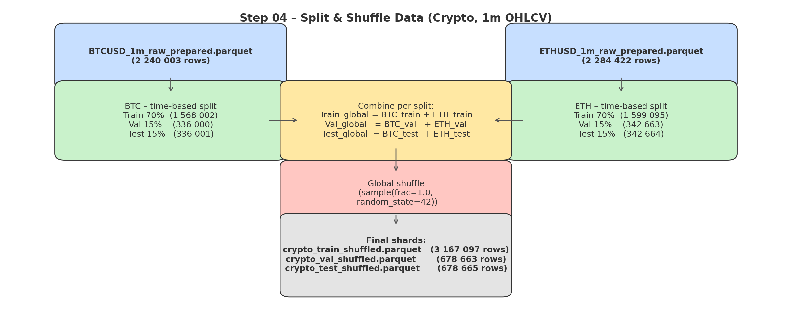
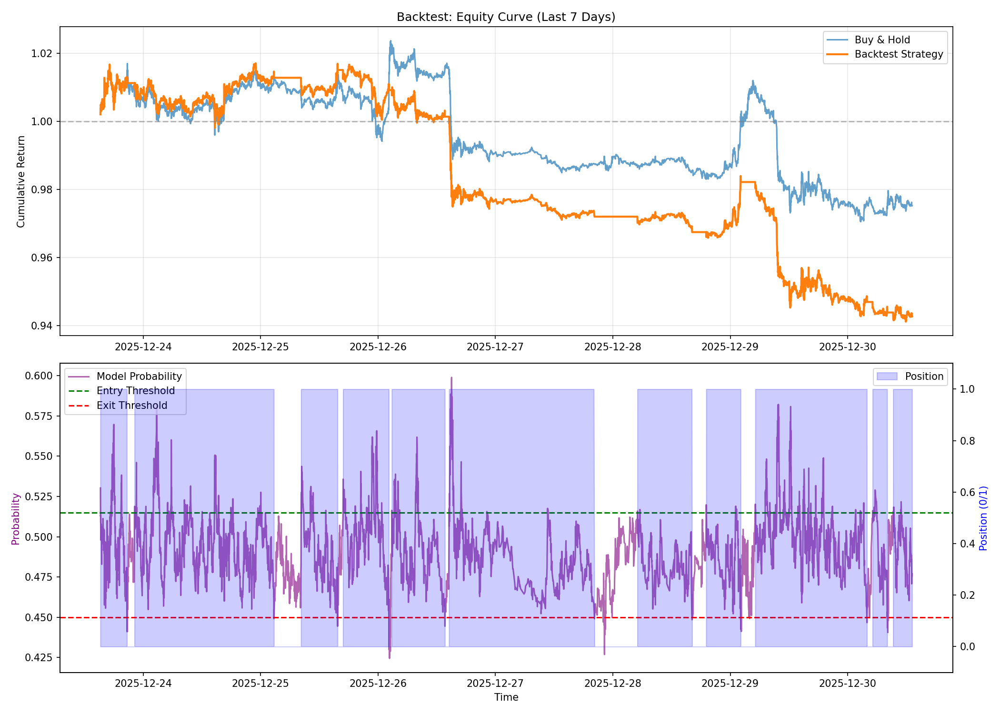
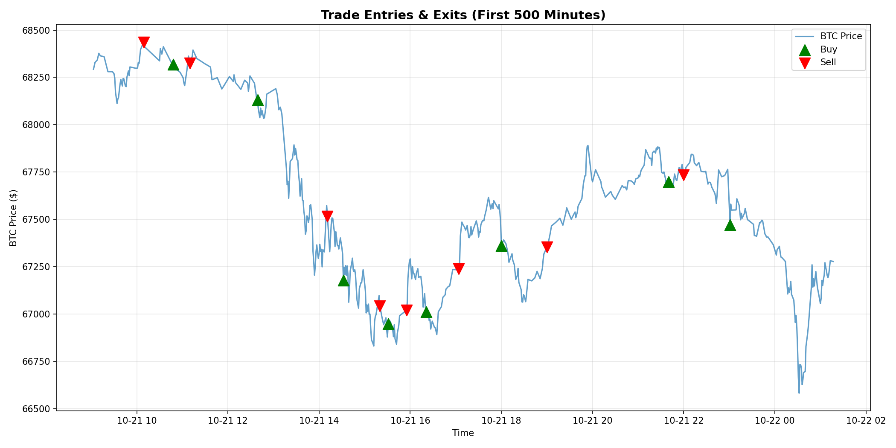
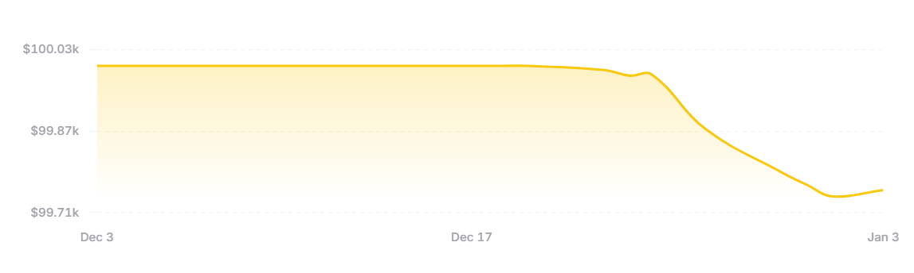

# Experiment 1

### Problem Definition:
**Target**

Vorhersage, ob der Preis von BTC/USD in den nächsten t = [5, 10, 15, 30, 60, 120, 240] Minuten steigt oder fällt in einem Zeitraum vom 01.01.2021 bis 15.11.2025
Dazu wird der Trend berechnet durch:
- lineare Regression des zukünftigen Preisfensters
- Normalisierung des Slopes durch den Durchschnittspreis
- binäre Label:
1 = Trend nach oben,
0 = Trend nach unten

Damit handelt es sich um ein Short-Term Crypto Trend Prediction Problem.

**Input Features**

Wir verzichten bewusst auf unnötig viele Indikatoren und konzentrieren uns auf wenige, erklärbare Features. Wenn wir uns sicherer fühlen, erweitern wir es natürlich.

Preisbasierte Features
- Normalisierte Close-Preise
- Log-Returns über 1 Minute

Trend-Features
- Normalisiertes exponential moving average (EMA) von t=[5, 10, 15, 20, 30, 60, 120, 240] minuten
- EMA-Differenz (Trendrichtung)
- Slope von EMA (Trendschärfe)

Volumen-Feature
- Normalisiertes Volumen

## Procedure Overview:

- Sammeln von 1-Minute OHLCV-Daten der Kryptowährungen BTC/USD und ETH/USD über die Alpaca Crypto API für den Zeitraum 01.01.2021 – 15.11.2025.
- Berechnung der Features: normalisierte Close-Preise, Log-Returns, EMAs (t = 5, 10, 15, 20, 30, 60, 120, 240 Minuten), EMA-Differenzen (z. B. EMA30 – EMA10), Slope von EMA und normalisiertes Handelsvolumen.
- Erstellung der Zielvariable für verschiedene Zeitfenster t ∈ {5, 15, 30, 60 Minuten}, die angibt, ob der Kurs steigt (1) oder fällt (0).
- Training eines neuronalen Netzwerks auf Basis dieser Features zur Vorhersage der kurzfristigen Trendrichtung (binäre Klassifikation) und Evaluation mittels zeitbasierter Train-/Validation-/Test-Splits.
- Optionales Backtesting der Modellvorhersagen in einer simplen Trading-Strategie: Long-Positionen bei positiven Trendvorhersagen eröffnen und für die jeweilige Dauer t halten.

---

### Data Acquisition

Extrahiert Rohdaten für BTC/USD und ETH/USD von der Alpaca Crypto API.

**Script**

[scripts/01_data_acquisition/crypto_data_acquisition.py](scripts/01_data_acquisition/crypto_data_acquisition.py)

Ruft 1-Minuten Daten von 2021-01-01 bis 2025-11-15 ab jeweils für BTC/USD und ETH/USD und speichert sie als .csv sowie .parquet Dateien in:
[data](data)


Beispiel für ETH/USD Daten:


Beispiel für BTC/USD Daten:


---

### Data Understanding
Visualisiert die Kursentwicklung und das Handelsvolumen von BTC und ETH und untersucht erste Eigenschaften wie auch Gemeinsamkeiten der Daten.

**Script**  

[02_crypto_data_understanding.py](scripts/02_data_understanding/02_crypto_data_understanding.py)

**Plots**  


**Erste Erkenntnisse**

- Die Close-Preise von BTC und ETH zeigen typische kurzfristige Schwankungen im Minutenbereich, wobei BTC tendenziell höhere Preisniveaus aufweist.
- Das Handelsvolumen variiert stark über die Zeit und zeigt Spitzen zu bestimmten Handelszeiten.
- BTC und ETH weisen teilweise ähnliche Bewegungsmuster auf, was auf eine gewisse Korrelation im Marktverhalten hinweist.

---

### Pre-Split Preparation
Berechnet alle Features und Targets aus den Rohdaten, die später in das Modell eingehen

**Script**

[crypto_data_preparation.py](scripts/03_pre_split_prep/crypto_data_preparation.py)

**Features** berechnet:
- Normalisierte Close-Preise
- Log-Returns über 1 Minute
- EMAs (t = 5, 10, 15, 20, 30, 60, 120, 240 Minuten)
- EMA-Differenzen (z. B. EMA30 – EMA10)
- Slope von EMA
- Rolling Volatility (t = 30 Minuten)
- RSI (Relative Strength Index, t = 14 Minuten)


**Targets** berechnet:
- Binäre Labels für t = [5, 10, 15, 30, 60, 120, 240] Minuten
- 1 = Trend nach oben (positiver Slope)
- 0 = Trend nach unten (negativer Slope)
- Trend wird berechnet mittels linearer Regression der Close-Preise des zukünftigen Zeitfensters t 

**Warum diese Features?**

- Vergleichbarkeit: Absolute Preise (z.B. 20.000$ vs 60.000$) verwirren das Modell. Wir nutzen Log-Returns (prozentuale Änderungen), damit alle Datenpunkte vergleichbar bleiben.

- Rauschen filtern: Minuten-Charts sind sehr chaotisch. EMAs (gleitende Durchschnitte) glätten den Kurs, um den echten Trend sichtbar zu machen.

- Marktpsychologie (RSI): hilft dem Modell zu erkennen, ob der Markt "überkauft" oder "überverkauft" ist – wichtige Signale für Trendwenden.

- Risiko (Volatilität): "Nervösität" des Marktes messen. Das Modell lernt so, zwischen ruhigen Phasen und explosiven Ausbrüchen zu unterscheiden.

- Normalisierung: Wir skalieren alle Werte auf eine ähnliche Größe (Z-Score), damit das neuronale Netz schneller lernt.

**Technische Umsetzung**

Speed: Statt 2,5 Millionen Zeilen einzeln zu berechnen (was Stunden dauert), nutzen wir Vektorisierung. Damit werden alle Berechnungen gleichzeitig ausgeführt (Dauer: wenige Sekunden).

**Ergebnisse der Datenanalyse (Findings)**

Balance: 
- Es gibt fast genau gleich viele "Up"- wie "Down"-Phasen (50/50 Verteilung). Das ist ideal, weil das Modell so nicht einseitig lernt.


Korrelation & Feature-Analyse:

- Redundanz (Der rote Block): Die starke Korrelation (≈ 1.00) zwischen den verschiedenen EMAs (ema_10, ema_60, ema_240) bestätigt, dass absolute Preis-Indikatoren fast identische Informationen liefern. Der langfristige Trend dominiert hier.

- Volatilität: Die Zeile volatility_30 zeigt nahezu keine Korrelation (0.00) zu den anderen Features. Dies beweist, dass die Volatilität eine statistisch unabhängige Information (Marktrisiko) liefert, die in den Trend-Daten nicht enthalten ist. Das ist ideal für das neuronale Netz.

- Momentum-Bestätigung (RSI): Der rsi_14_norm zeigt eine sinnvolle Korrelation zum Slope (0.67), aber keine Korrelation zum absoluten Preis-Level (EMAs ≈ 0.00). Er fungiert als Bindeglied zwischen kurzfristigem Momentum und überkauften Zuständen.


---

### Step 04 – Split & Shuffle Data

[04_crypto_split_data.py](scripts/04_split_data/04_crypto_split_data.py)

Nach der Feature- und Target-Generierung werden die Daten für BTCUSD und ETHUSD getrennt einem strikt zeitbasierten Split unterzogen. Dabei dienen die ältesten 70 % der Daten als Trainingsmenge, die folgenden 15 % als Validierungsmenge und die jüngsten 15 % als Testmenge. Dieser chronologische Ansatz verhindert Data Leakage und stellt sicher, dass das Modell ausschließlich aus Vergangenheitsdaten lernt und auf späteren Marktphasen evaluiert wird.

Im nächsten Schritt werden die symbolweisen Splits zu globalen Datensätzen zusammengeführt:

* `Train_global = BTC_train + ETH_train`
* `Val_global   = BTC_val   + ETH_val`
* `Test_global  = BTC_test  + ETH_test`

Anschließend erfolgt ein globales Shuffling der drei Datensätze (`sample(frac=1.0, random_state=42)`). Dadurch enthalten die Trainingsbatches später Daten aus unterschiedlichen Zeitabschnitten und aus beiden Assets, was die Generalisierung des Modells verbessert und Overfitting reduziert.

### Final Output Sizes

| Dataset                   | Rows      |
| ------------------------- | --------- |
| **Train (shuffled)**      | 3 167 097 |
| **Validation (shuffled)** | 678 663   |
| **Test (shuffled)**       | 678 665   |

Gespeicherte Dateien:

* `crypto_train_shuffled.parquet`
* `crypto_val_shuffled.parquet`
* `crypto_test_shuffled.parquet`

### Split & Shuffle Flowchart




### Split ohne shuffle

[04_crypto_split_data2.py](scripts/04_split_data/04_crypto_split_data2.py)

Für unser Time-Series-Problem wird die Datenaufteilung zeitbasiert durchgeführt. Ein zufälliger Split ist nicht erlaubt, da er zukünftige Informationen in die Vergangenheit bringen würde.

**Grundidee:**
- BTC ist unser Target (Trendvorhersage).
- ETH wird als Feature genutzt, um Marktinformationen hinzuzufügen.
- BTC bestimmt die Zeitachse, ETH wird synchronisiert und als Feature hinzugefügt.

**Warum dieser Split sicher ist:**
- Chronologische Trennung verhindert Data Leakage.
- Die ETH-Daten werden korrekt zur BTC-Serie gematcht, ohne Zeilen zu verlieren.
- Modelle sehen nur Informationen aus der Vergangenheit für Vorhersagen in die Zukunft.

**Split-Verhältnisse:**
70% Train
15% Validation
15% Test

### Model Training

[07_feed_forward.py](scripts/07_model_training/07_feed_forward.py)

- Lädt die Experimentkonfiguration und die Featureliste (features.txt).
- Lädt Trainings-, Validierungs- und Testdaten aus Parquet-Dateien und normalisiert die Features mit StandardScaler.
- Erstellt ein MLP mit 2 versteckten Schichten (128 und 64 Neuronen), ReLU-Aktivierungen, Dropout 0.3 und einem Output für binäre Klassifikation.
- Trainiert mit BCEWithLogitsLoss, AdamW-Optimizer (LR 0.001, Weight Decay 0.0001), Batch-Größe 2048 und Early Stopping nach 7 Epochen ohne Verbesserung.
- Speichert das beste Modell (best_model.pt) und den Feature-Scaler (feature_scaler.pkl)


### Model Testing

[07_feed_forward.py](scripts/07_model_training/07_feed_forward.py) (Die evaluierung methode ist da)

[Eval.txt](scripts/08_model_testing/Eval.txt) (Die anderen Tests)

Um Overfitting zu adressieren, das in initialen Experimenten beobachtet wurde, wurden folgende Maßnahmen implementiert:

- Feature Set Redesign: Anstatt BTC-Features zur Vorhersage von BTC-Targets zu nutzen (potenzielle Data Leakage), wurden ausschließlich ETH-Features als Prädiktoren verwendet. Diese Cross-Asset-Strategie reduziert die Gefahr des Overfitting und nutzt die Korrelation zwischen ETH und BTC zur Generalisierung.

- Erhöhte Regularisierung: Dropout wurde von 0.3 auf 0.5-0.6 erhöht, um robusteres Feature Learning zu erzwingen.


| Parameter | Getestete Werte |
|-----------|-----------------|
| **Dropout** | 0.5, 0.6 |
| **Learning Rate** | 1e-3, 5e-4 |
| **Hidden Layers** | (128, 64), (64, 32) |

Insgesamt getestete Konfigurationen: 5


**Ergebnisse**

| Experiment | Dropout | LR | Hidden | Val Acc | Test Acc | Gap | Precision | Recall | ROC-AUC |
|------|-----|----|--------|--------|--------|----|--------|--------|----------------|
| 4 | 0.6 | 5e-4 | 128,64 | 51.97% | 51.08% | 0.89% | 51.07% | 51.50% | 0.5158 |


**Finales Model**

Optimale Konfiguration:
- Architecture: MLP mit 2 Hidden Layers (128, 64 Neuronen)
- Dropout: 0.6 (aggressiv zur Overfitting-Prevention)
- Learning Rate: 5e-4 
- Optimizer: AdamW mit Weight Decay 1e-4
- Batch Size: 2048

Performance-Metriken:
- Validation Accuracy: 51.97%
- Test Accuracy: 51.08%
- Generalisierungs-Gap: 0.89% 
- ROC-AUC: 0.5158 (statistisch signifikant über Random Baseline von 0.5)


Precision (51.07%):
> "When model says 'Up', it's right 51.07% of the time"

Recall (51.50%):
> "Model catches 51.50% of all Up moves"


### Deployment
[09_backtesting.py](scripts/09_deployment/09_backtesting.py)

[09_paper_trading.py](scripts/09_deployment/09_paper_trading.py)


## Trading Bot Development 

[09_paper_trading_updated.py](scripts/09_deployment/09_paper_trading_updated.py)

[09_Backtesting_val.py](scripts/09_deployment/09_Backtesting_val.py)

[Live_performance_analyzer.py](scripts/09_deployment/Live_performance_analyzer.py)

Unser Trading Bot durchlief mehrere Iterationen, um von einem unprofitablen System zu einem stabilen, risikogesteuerten System zu werden. Die Haupterkenntnis: Risk Management ist wichtig.

**Wichtigste Ergebnisse:**
-  Model Accuracy: 51%-52%
-  Mit richtigem Risk Management: Profitabel trotz niedriger Accuracy
-  Finale R/R Ratio: 2.5:1

---

**Phase 1: Initiale Version (v1.0) - Das Problem**

### Setup
```
Model: MLP Neural Network (3 Layer)
Accuracy: ca. 51%
Entry: Probability > 0.515
Exit: Probability < 0.49 (manuelle Exits)
Stop Loss: ATR-basiert 
Take Profit: ATR-basiert 
```

### Performance nach 24 Stunden
```
Trades: 38
Win Rate: 47.4%
Average Win: +0.152%  
Average Loss: -0.344%
R/R Ratio: 0.44:1 
Total PnL: -$40.63
ROI: -0.26%
```

### Das Problem: Variable Risk Management

**Trade Beispiele aus trade_journal_v2.csv:**

| Trade | Entry Price | Exit Price | Outcome | Grund |
|-------|------------|------------|---------|-------|
| 7 | $88,003.70 | $88,742.02 | +0.839% | Manueller Exit bei Prob < 0.49 |
| 8 | $88,349.28 | $88,382.13 | +0.037% | Manueller Exit bei Prob < 0.49 |
| 9 | $88,499.57 | $88,347.30 | -0.172% | Manueller Exit bei Prob < 0.49 |

**Kernproblem:** Bot verkaufte basierend auf Probability-Drops, nicht auf klaren Preis-Zielen!
- Winning Trades wurden zu früh beendet
- Losing Trades liefen zu lange
- Keine konsistente Risk/Reward Ratio

---

### Phase 2: Threshold Calibration - Erste Verbesserungsversuche

**Analyse der Probability Distribution**

Wir analysierten 1000+ Predictions um optimale Thresholds zu finden:

```
Probability Range: 0.4405 - 0.5290
Mean: 0.4865
10th Percentile: 0.4670
90th Percentile: 0.5170
```

**Erster Versuch: Breitere Thresholds**
```
Entry Threshold: 0.517 (90th percentile)
Exit Threshold: 0.467 (10th percentile)
Gap: 0.05 (breiter als vorher: 0.025)
```

**Hypothese:** Breiterer Gap = Trades laufen länger = Höhere Gewinne

**Ergebnis:** Problem blieb bestehen
- Manuelle Exits triggerten immer noch zu früh
- R/R Ratio blieb bei um 0.44:1

**Erkenntnis:** Das Problem war nicht der Threshold-Gap, sondern die Exit-Logik selbst

---




### Phase 3: Risk Management (v2.0)

**Die Lösung: Fixed Stop Loss & Take Profit**

**Neue Strategie:**
```python
STOP_LOSS_PCT = 0.005   # FIXED -0.5%
TAKE_PROFIT_PCT = 0.015  # FIXED +1.5%
```

**Entry Logic:**
```python
if probability > 0.516 and not has_position:
    BUY with bracket orders:
    - Take Profit @ Entry × 1.015
    - Stop Loss @ Entry × 0.995
```

**Exit Logic:**
```python
# KEINE manuelle Exit Logic mehr!
# Nur Bracket Orders handeln Exits
```

**Die Mathematik dahinter**

Mit 51% Win Rate und 3:1 R/R:
```
Expected Value per Trade:
= (Win Rate × Win Size) - (Loss Rate × Loss Size)
= (0.51 × 1.5%) - (0.49 × 0.5%)
= 0.765% - 0.245%
= +0.52% per Trade 

Breakeven Win Rate:
= Loss Size / (Win Size + Loss Size)
= 0.5% / (1.5% + 0.5%)
= 25%

Profitabel selbst bei nur 25% Win Rate
```

Das bedeutet: Selbst wenn unser Modell nur 30% Accuracy hätte, wäre der Bot noch profitabel!

---

### Phase 4: The Bracket Orders Problem

**Test von v2.0 (01.01.2026, 00:30)**

**Trade:**
```
Entry: $87,814.15 (01.01 15:04)
Erwartet TP: $89,131.36 (+1.5%)
Erwartet SL: $87,375.09 (-0.5%)
```

**Was passierte:**
- Trade lief 30+ Stunden
- Preis erreichte $89,438 über dem TP
- Position blieb offen 

### Das Problem: Alpaca Crypto API

Grund 1: Bracket Orders wurden nicht erstellt

Erkenntnis: Alpaca's Crypto API unterstützt keine Bracket Orders wie die Stock API

Grund 2: Limit Order wurde übersprungen

```
TP @ $89,131 (Limit Order)
Preis sprang von $88,900 → $89,500
→ Limit Order nicht triggered!
```

---

### Phase 5: Failsafe Implementation (v2.1)

**Die Lösung: Bot-basierte Exit Logic**

Da Alpaca's Bracket Orders nicht funktionierten, implementierten wir eine Failsafe Logic:

```python
elif has_position:
    tp_price = entry_price × 1.015
    sl_price = entry_price × 0.995
    
    if current_price >= tp_price:
        # VERKAUFE bei Take Profit
        trading_client.close_position()
        log_trade('SELL', TP reached)
        
    elif current_price <= sl_price:
        # VERKAUFE bei Stop Loss
        trading_client.close_position()
        log_trade('SELL', SL reached)
    
    else:
        # HALTE Position
        logger.info("HOLDING")
```

**Vorteil:** Bot checkt jede Minute ob TP oder SL erreicht wurde und handelt entsprechend.

**Nachteil:** 60-Sekunden-Interval kann Slippage verursachen.

---

## Phase 6: Live Test mit Failsafe (02.01.2026, 18:50)

### Trade #3 Analyse

**Setup:**
```
CONFIDENCE_THRESHOLD = 0.512
Entry: $90,284.20 (02.01 18:49)
TP Target: $91,638.46 (+1.5%)
SL Target: $89,832.78 (-0.5%)
```

**Minute-by-Minute Log:**
```
19:52:50 - Price: $89,873.63 (über SL)
         - Status: HOLDING
         
19:53:50 - Price: $89,505.48 (unter SL)
         - Failsafe triggered!
         - Position closed
```

**Ergebnis:**
```
Exit Price: $89,505.48
Actual Loss: -0.86%
Expected Loss: -0.5%
Slippage: 0.36%
```

### Warum Slippage?

**BTC fiel $368 in 60 Sekunden!**
```
19:52:50: $89,873
19:53:50: $89,505
→ -0.41% in 60 Sekunden (Flash Crash)
```

Problem: Bot checked nur alle 60 Sekunden → Verpasste den optimalen SL-Trigger bei $89,832

Aber: Die Failsafe Logic funktionierte! Bot erkannte SL-Verletzung und verkaufte automatisch.

