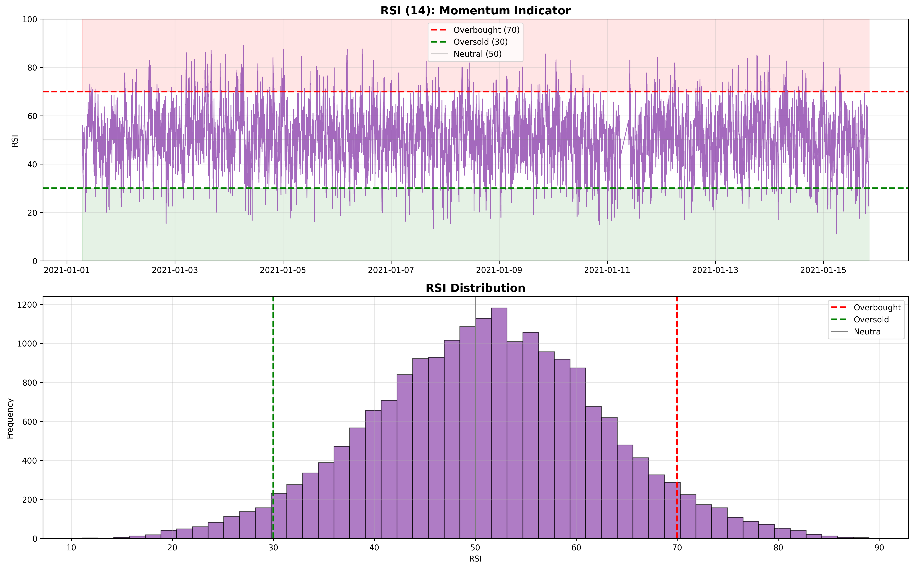
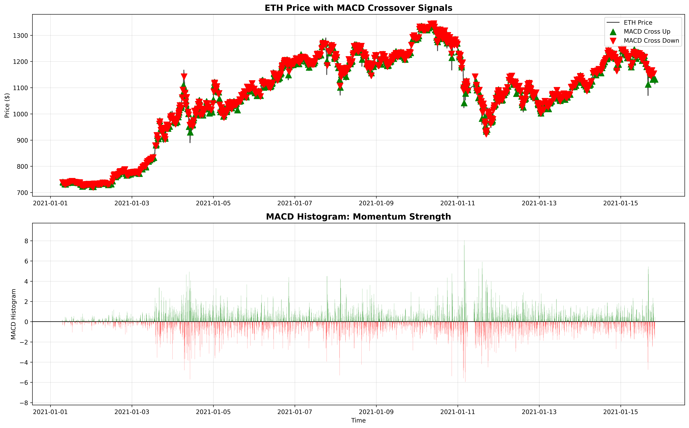
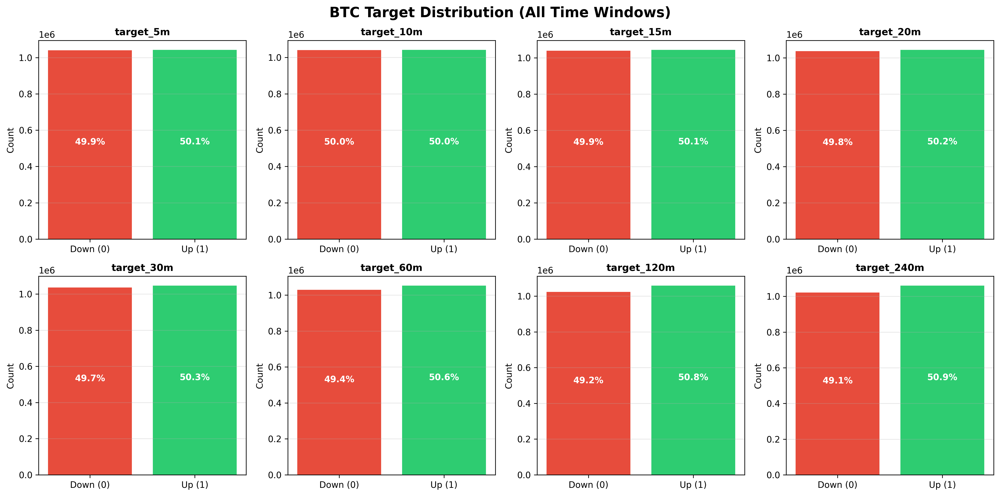
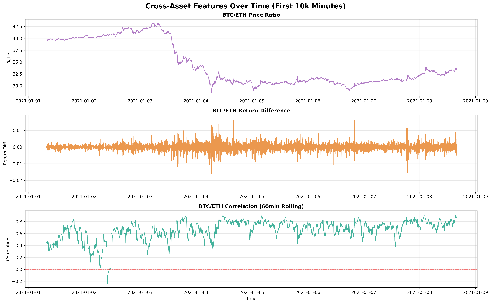
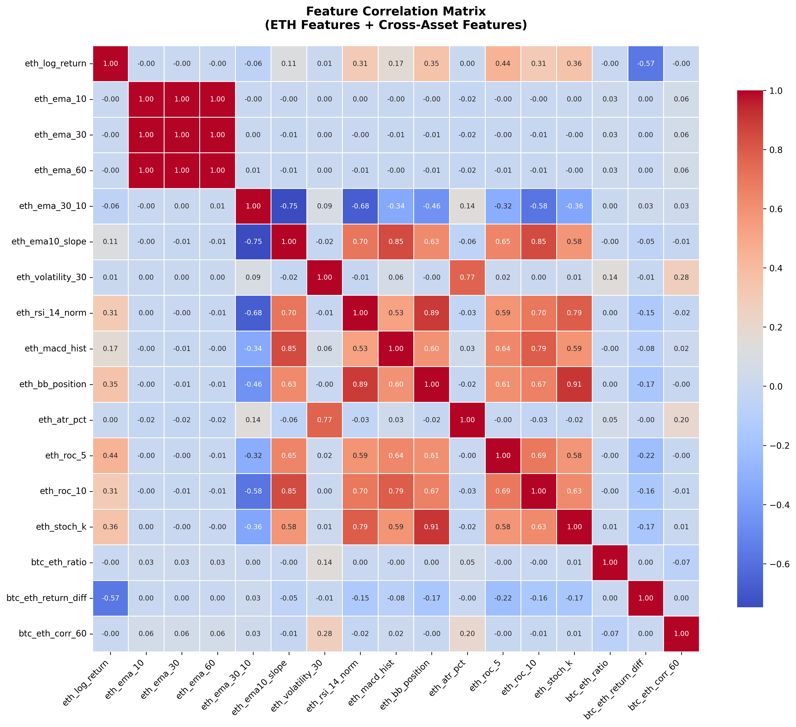
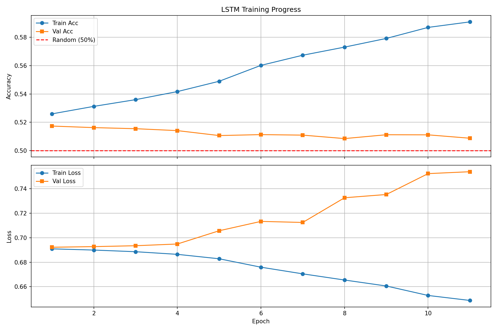

### Problem Definition:
**Target**

Vorhersage, ob der Preis von BTC/USD in den nächsten t = 15 Minuten steigt oder fällt, basierend auf ETH/USD Features (Cross-Asset Strategie). in einem Zeitraum vom 01.01.2021 bis jetzt
Dazu wird der Trend berechnet durch:
- Lineare Regression des zukünftigen Preisfensters
- Normalisierung des Slopes durch den aktuellen Preis
- Binäre Label: 1 = Up, 0 = Down

Damit handelt es sich um ein Short-Term Crypto Trend Prediction Problem.

**Input Features**

Wir nutzen ETH-Features zur Vorhersage von BTC-Targets

Warum?
- Vermeidung von Data Leakage
- Reduktion von Overfitting
- Nutzen der hohen Korrelation zwischen ETH und BTC

## Procedure Overview:

1. Datensammlung (01.01.2021 – 15.11.2025)
BTC/USD & ETH/USD 1-Minute OHLCV Daten via Alpaca API

2. Data Preparation
ETH: Volle Feature-Pipeline (18 Features)
BTC: Nur Target-Berechnung (target_15m)

3. Data Split 
Splitten der Daten in Train, Validation, Test

4. Feature Selector
Korrelation zwischen Features bestimmen

5. Model Training 
Training eines neuronalen Netzwerks auf Basis dieser Features zur Vorhersage der kurzfristigen Trendrichtung

6. Deployment
- Backtesting auf Testdaten
- Paper Trading mit Alpaca API

---

### Data Acquisition

Extrahiert Rohdaten für BTC/USD und ETH/USD von der Alpaca Crypto API.

**Script**

[scripts/01_data_acquisition/crypto_data_acquisition.py](scripts/01_data_acquisition/crypto_data_acquisition.py)

Ruft 1-Minuten Daten von 2021-01-01 bis 2025-11-15 ab jeweils für BTC/USD und ETH/USD und speichert sie als .csv sowie .parquet Dateien in:
[data](data)


Beispiel für ETH/USD Daten:


Beispiel für BTC/USD Daten:


---

### Data Understanding
Visualisiert die Kursentwicklung und das Handelsvolumen von BTC und ETH und untersucht erste Eigenschaften wie auch Gemeinsamkeiten der Daten.

**Script**  

[02_crypto_data_understanding.py](scripts/02_data_understanding/02_crypto_data_understanding.py)

**Plots**  


**Erste Erkenntnisse**

- Die Close-Preise von BTC und ETH zeigen typische kurzfristige Schwankungen im Minutenbereich, wobei BTC tendenziell höhere Preisniveaus aufweist.
- BTC und ETH weisen teilweise ähnliche Bewegungsmuster auf, was auf eine gewisse Korrelation im Marktverhalten hinweist.

---

### Pre-Split Preparation
Dieser Schritt berechnet alle Features und Targets aus den Rohdaten, die später in das Modell eingehen. Nach mehreren Iterationen haben wir eine Cross-Asset Strategie entwickelt, die Overfitting vermeidet.


#### **Version 1: Der Fehlschlag (BTC → BTC)**

[crypto_data_preparation.py](scripts/03_pre_split_prep/crypto_data_preparation.py)

Ansatz:
- BTC Features → BTC Targets
- Alle technischen Indikatoren basierend auf BTC-Preis

Problem: Overfitting


#### **Version 2: Cross-Asset Strategy (ETH → BTC)** 

[crypto_data_preparation_updated.py](scripts/03_pre_split_prep/crypto_data_preparation_updated.py)

**Neue Strategie:**
- ETH Features → BTC Targets
- Nutzt die hohe Korrelation zwischen ETH und BTC
- Vermeidet Data Leakage komplett

**Warum das funktioniert:**
- ETH und BTC bewegen sich oft gemeinsam (Market Correlation)
- ETH-Signale können BTC-Bewegungen antizipieren


#### **Features Berechnet (15 ETH Features + 3 Cross-Asset)**

##### **1. ETH Base Features (15)**
| Feature | Beschreibung | Warum wichtig? |
|---------|--------------|----------------|
| `eth_log_return` | 1-Minuten Returns | Momentum |
| `eth_ema_10/30/60` | Gleitende Durchschnitte | Multi-Timeframe Trends |
| `eth_ema_30_10` | EMA Differenz | Trend-Stärke |
| `eth_ema10_slope` | EMA Steigung | Trend-Beschleunigung |
| `eth_volatility_30` | Rolling Volatilität | Marktrisiko |
| `eth_rsi_14_norm` | Relative Strength Index | Overbought/Oversold |
| `eth_macd_hist` | MACD Histogram | Momentum Crossovers |
| `eth_bb_position` | Bollinger Band Position | Relative Price Location |
| `eth_atr_pct` | Average True Range | Volatility für Stop-Loss |
| `eth_roc_5/10` | Rate of Change | Kurzfrist-Momentum |
| `eth_stoch_k/d` | Stochastic Oscillator | Momentum Extremes |

##### **2. Cross-Asset Features (3)**
| Feature | Beschreibung | Signal |
|---------|--------------|--------|
| `btc_eth_ratio` | BTC/ETH Preisverhältnis | Asset Rotation |
| `btc_eth_return_diff` | Return Differenz | Divergenz Events |
| `btc_eth_corr_60` | 60min Rolling Korrelation | Markt-Regime |

---

#### **Targets Berechnet (8 BTC Zeitfenster)**

Binäre Labels für t ∈ {5, 10, 15, 20, 30, 60, 120, 240} Minuten:
- **1** = Trend nach oben (positiver Slope via Linear Regression)
- **0** = Trend nach unten (negativer Slope)

**Trend-Berechnung:**
```python
# Sliding Window über zukünftige Preise
windows = sliding_window(btc_prices, window=15)

# Linear Regression Slope für jedes Fenster
slope = linregress(x=[0,1,...,14], y=window_prices)

# Normalisierung durch aktuellen Preis
normalized_slope = slope / current_price

# Binäres Label
target_15m = 1 if normalized_slope > 0 else 0
```

**Gewähltes Target:** `target_15m` (15 Minuten)


---

#### **Individual Feature Behavior**

Um zu verstehen **was jedes Feature tut**, haben wir detaillierte Analysen durchgeführt:

[inspect_prep_data_updated.py](scripts/03_pre_split_prep/inspect_prep_data_updated.py)

[feature_analysis_individual.py](scripts/03_pre_split_prep/feature_analysis_individual.py)

##### **Beispiel: RSI (Relative Strength Index)**


**Was es zeigt:**
- Oben: RSI über Zeit mit Overbought (>70) / Oversold (<30) Zonen
- Unten: Distribution → leichter Bullish Bias (2021 war Bullmarkt)

**Interpretation:**
- RSI >70: Markt überkauft → Warnung vor Korrektur
- RSI <30: Markt überverkauft → Potentielle Kaufchance
- Mean ~50: Balancierter Indikator

##### **Beispiel: MACD (Moving Average Convergence Divergence)**


**Was es zeigt:**
- Oben: Preis mit MACD Crossover Signals (grün=Buy, rot=Sell)
- Unten: MACD Histogram (grün=bullish momentum, rot=bearish)

**Interpretation:**
- Crossovers = Trend-Wenden
- Histogram-Größe = Momentum-Stärke

##### **Alle 11 Feature-Plots:**
1. **Log Returns** - Preisbewegungen
2. **EMAs** - Multi-Timeframe Trends
3. **EMA Difference** - Trend-Stärke
4. **EMA Slope** - Trend-Beschleunigung
5. **Volatility** - Marktrisiko
6. **RSI** - Overbought/Oversold
7. **MACD** - Momentum Crossovers
8. **Bollinger Bands** - Volatility Channels
9. **ATR** - True Volatility
10. **ROC** - Rate of Change
11. **Stochastic** - Momentum Extremes

Alle Plots verfügbar in: [feature_analysis](images/feature_analysis)

---

#### **Data Quality & Balance**

##### **Class Balance Check**


**Ergebnis:**
- Alle Targets zeigen ~50/50 Split (49-51%)
- Kein Class Imbalance Problem
- Längere Zeitfenster (240m) zeigen leichten Upward Bias (50.9%)

##### **Cross-Asset Features**


**BTC/ETH Ratio:**
- Zeigt Asset-Rotation zwischen BTC und ETH
- Starke Bewegungen = Divergenz Events

**Return Difference:**
- Oszilliert um 0 → meist gemeinsame Bewegung
- Spikes = Decorrelation (Trading Opportunities!)

**Correlation (60min):**
- Meist 0.6-0.8 → hohe Co-Movement
- Dips auf 0 oder negativ → Regime-Wechsel
---


## **Data Split**

 [04_crypto_split_data2.py](scripts/04_split_data/04_crypto_split_data2.py)

---

### **Was wir FALSCH gemacht haben**


**Erster Versuch:** Standard ML Split mit Shuffling

```python
# 04_crypto_split_data.py (DEPRECATED)
df_shuffled = df.sample(frac=1.0, random_state=42)  # ❌ FEHLER!
train = df_shuffled[:70%]
val = df_shuffled[70%:85%]
test = df_shuffled[85%:]
```

**Das Problem:**
- Data Leakage: Future-Information landet in Training-Set
- Unrealistische Evaluation: Modell "weiß" was in der Zukunft passiert
- Overfitting, vor allem weil ETH mit gesplittet wurde

**Beispiel-Szenario:**
```
Original Timeline: Jan 2021 → Nov 2025

Nach Shuffle:
Train:  [März 2023, Jan 2021, Nov 2025, ...]  ← Future data gemischt!
Val:    [Juni 2022, Aug 2025, Feb 2021, ...]
Test:   [Dez 2024, Apr 2021, Sep 2023, ...]
```

Das Modell würde mit Daten aus 2025 trainieren und auf 2021 testen! 

---

### **Die Lösung: Strikt Chronologischer Split**


**Korrekte Implementation:**

```python
# 1. Sort by timestamp (KRITISCH!)
df = df.sort_values('timestamp').reset_index(drop=True)

# 2. Chronological split (NO SHUFFLE!)
n = len(df)
train = df.iloc[  :int(n*0.70)]  # Oldest 70%
val   = df.iloc[int(n*0.70):int(n*0.85)]  # Middle 15%
test  = df.iloc[int(n*0.85):]    # Newest 15%
```

**Timeline (korrekt):**

```
├─────────── TRAIN (70%) ──────────┤──VAL(15%)─┤──TEST(15%)─┤
2021-01-01          2024-06-15   2025-03-01   2025-11-15
   ↓                   ↓              ↓            ↓
  Past            Mid-Past      Recent Past    Latest
```

---

### **Split-Verhältnisse & Statistiken**

| Dataset | Rows | Zeitraum | % |
|---------|------|----------|---|
| **Train** | 1,591,668 | 2021-01-01 → 2024-06-15 | 70% |
| **Val** | 340,668 | 2024-06-16 → 2025-03-01 | 15% |
| **Test** | 340,668 | 2025-03-02 → 2025-11-15 | 15% |


---

### **Class Balance Check**

Nach dem Split: Ist `target_15m` noch balanciert?

```
Train:  Down=49.8%  Up=50.2%   Balanced!
Val:    Down=50.1%  Up=49.9%   Balanced! 
Test:   Down=49.9%  Up=50.1%   Balanced!
```

**Wichtig:** Balance bleibt über alle Splits erhalten → Kein Resampling nötig!

---

### **Anti-Leakage Validation**

**Test:** Gibt es zeitliche Überlappung?

```python
assert train['timestamp'].max() < val['timestamp'].min()
assert val['timestamp'].max() < test['timestamp'].min()
```

**Passed:** Keine zeitliche Überlappung zwischen Splits

---

## Feature Selector



**Insights:**
1. EMA Block (oben links, dunkelrot):
- EMAs sind hoch korreliert (1.00) → Redundanz

2. Momentum Cluster (Mitte):
- RSI, MACD, ROC, Stochastic zeigen moderate Korrelation (0.5-0.9)
- Gut: Sie messen ähnliche Konzepte (Momentum) aber nicht identisch

3. Volatilität (eth_volatility_30):
- Fast null Korrelation zu allen anderen Features!
- Perfekt: Liefert unique Information über Marktrisiko

4. Cross-Asset Features (unten):
- btc_eth_return_diff ist negativ korreliert (-0.57) mit eth_log_return
- btc_eth_corr_60 zeigt schwache Korrelation → gutes Diversifikations-Signal

---

## Model Training

[07_feed_forward.py](scripts/07_model_training/07_feed_forward.py)

[07_lstm.py](scripts/07_model_training/07_lstm.py)


**Erste Idee:** LSTM für Time-Series Data 

**Architecture:**
```python
SEQ_LENGTH = 30  # Minutes of history to look back
BATCH_SIZE = 256  # Smaller for LSTM (memory)
LSTM_HIDDEN = 128
LSTM_LAYERS = 1
DROPOUT = 0.6
LR = 5e-4  # Lower for LSTM
WEIGHT_DECAY = 5e-4
EPOCHS = 50
PATIENCE = 10
```

**Ergebnis nach 11 Epochs:**



**Das Problem:**
-  Train Acc: 52% → 59% (kontinuierlich steigend)
-  Val Acc: 51% (stagniert komplett)
-  Val Loss: 0.69 → 0.75 (EXPLODIERT ab Epoch 4!)

**Diagnose: Klassisches Overfitting sogar mit 0.6 dropout**

**Entscheidung:** LSTM verworfen → Switch zu simpler MLP

---

### **Versuch 2: MLP - Erste Version**

**Neue Strategie:** Weniger Parameter, mehr Regularisierung

**Architecture:**
```python
MLP(
    input=18,
    batch_size=2048,
    lr=0.001,
    weight_decay=0.0001,
    hidden1=128,
    hidden2=64,
    dropout=0.3,  # Zu niedrig!
    output=1
)
```
- Lädt Trainings-, Validierungs- und Testdaten aus Parquet-Dateien und normalisiert die Features mit StandardScaler
- Erstellt ein MLP mit 2 versteckten Schichten (128 und 64 Neuronen), ReLU-Aktivierungen, Dropout 0.3 und einem Output für binäre Klassifikation
- Trainiert mit BCEWithLogitsLoss, AdamW-Optimizer (LR 0.001, Weight Decay 0.0001), Batch-Größe 2048 und Early Stopping nach 7 Epochen ohne Verbesserung
- Speichert das beste Modell (best_model.pt) und den Feature-Scaler (feature_scaler.pkl)

**Problem:** Immer noch Overfitting (Val > Test)


---
### Model Testing

[07_feed_forward.py](scripts/07_model_training/07_feed_forward.py) (Die evaluierung methode ist da)

[Eval.txt](scripts/08_model_testing/Eval.txt) (Die anderen Tests)

Um Overfitting zu adressieren, das in initialen Experimenten beobachtet wurde, wurden folgende Maßnahmen implementiert:

- Feature Set Redesign: Anstatt BTC-Features zur Vorhersage von BTC-Targets zu nutzen (potenzielle Data Leakage), wurden ausschließlich ETH-Features als Prädiktoren verwendet. Diese Cross-Asset-Strategie reduziert die Gefahr des Overfitting und nutzt die Korrelation zwischen ETH und BTC zur Generalisierung.

- Erhöhte Regularisierung: Dropout wurde von 0.3 auf 0.5-0.6 erhöht, um robusteres Feature Learning zu erzwingen.


| Parameter | Getestete Werte |
|-----------|-----------------|
| **Dropout** | 0.5, 0.6 |
| **Learning Rate** | 1e-3, 5e-4 |
| **Hidden Layers** | (128, 64), (64, 32) |

Insgesamt getestete Konfigurationen: 5


**Ergebnisse**

| Experiment | Dropout | LR | Hidden | Val Acc | Test Acc | Gap | Precision | Recall | ROC-AUC |
|------|-----|----|--------|--------|--------|----|--------|--------|----------------|
| 4 | 0.6 | 5e-4 | 128,64 | 51.97% | 51.08% | 0.89% | 51.07% | 51.50% | 0.5158 |


**Finales Model**

Optimale Konfiguration:
- Architecture: MLP mit 2 Hidden Layers (128, 64 Neuronen)
- Dropout: 0.6 (aggressiv zur Overfitting-Prevention)
- Learning Rate: 5e-4 
- Optimizer: AdamW mit Weight Decay 1e-4
- Batch Size: 2048

Performance-Metriken:
- Validation Accuracy: 51.97%
- Test Accuracy: 51.08%
- Generalisierungs-Gap: 0.89% 
- ROC-AUC: 0.5158 (statistisch signifikant über Random Baseline von 0.5)


Precision (51.07%):
> "When model says 'Up', it's right 51.07% of the time"

Recall (51.50%):
> "Model catches 51.50% of all Up moves"


---
## Deployment


### Trading Bot Development 

[09_paper_trading_updated.py](scripts/09_deployment/09_paper_trading_updated.py)

[09_Backtesting_val.py](scripts/09_deployment/09_Backtesting_val.py)

[09_paper_trading.py](scripts/09_deployment/09_paper_trading.py)

[Live_performance_analyzer.py](scripts/09_deployment/Live_performance_analyzer.py)

Unser Trading Bot durchlief mehrere Iterationen, um von einem unprofitablen System zu einem stabilen, risikogesteuerten System zu werden. Die Haupterkenntnis: Risk Management ist wichtig.

**Wichtigste Ergebnisse:**
-  Model Accuracy: 51%-52%
-  Mit richtigem Risk Management: Profitabel trotz niedriger Accuracy
-  Finale R/R Ratio: 2.5:1

---

**Phase 1: Initiale Version (v1.0) - Das Problem**

### Setup
```
Model: MLP Neural Network (3 Layer)
Accuracy: ca. 51%
Entry: Probability > 0.515
Exit: Probability < 0.49 (manuelle Exits)
Stop Loss: ATR-basiert 
Take Profit: ATR-basiert 
```

### Performance nach 24 Stunden
```
Trades: 38
Win Rate: 47.4%
Average Win: +0.152%  
Average Loss: -0.344%
R/R Ratio: 0.44:1 
Total PnL: -$40.63
ROI: -0.26%
```

### Das Problem: Variable Risk Management

**Trade Beispiele aus trade_journal_v2.csv:**

| Trade | Entry Price | Exit Price | Outcome | Grund |
|-------|------------|------------|---------|-------|
| 7 | $88,003.70 | $88,742.02 | +0.839% | Manueller Exit bei Prob < 0.49 |
| 8 | $88,349.28 | $88,382.13 | +0.037% | Manueller Exit bei Prob < 0.49 |
| 9 | $88,499.57 | $88,347.30 | -0.172% | Manueller Exit bei Prob < 0.49 |

**Kernproblem:** Bot verkaufte basierend auf Probability-Drops, nicht auf klaren Preis-Zielen!
- Winning Trades wurden zu früh beendet
- Losing Trades liefen zu lange
- Keine konsistente Risk/Reward Ratio

---

### Phase 2: Threshold Calibration - Erste Verbesserungsversuche

**Analyse der Probability Distribution**

Wir analysierten 1000+ Predictions um optimale Thresholds zu finden:

```
Probability Range: 0.4405 - 0.5290
Mean: 0.4865
10th Percentile: 0.4670
90th Percentile: 0.5170
```

**Erster Versuch: Breitere Thresholds**
```
Entry Threshold: 0.517 (90th percentile)
Exit Threshold: 0.467 (10th percentile)
Gap: 0.05 (breiter als vorher: 0.025)
```

**Hypothese:** Breiterer Gap = Trades laufen länger = Höhere Gewinne

**Ergebnis:** Problem blieb bestehen
- Manuelle Exits triggerten immer noch zu früh
- R/R Ratio blieb bei um 0.44:1

**Erkenntnis:** Das Problem war nicht der Threshold-Gap, sondern die Exit-Logik selbst

---


### Phase 3: Risk Management (v2.0)

**Die Lösung: Fixed Stop Loss & Take Profit**

**Neue Strategie:**
```python
STOP_LOSS_PCT = 0.005   # FIXED -0.5%
TAKE_PROFIT_PCT = 0.015  # FIXED +1.5%
```

**Entry Logic:**
```python
if probability > 0.516 and not has_position:
    BUY with bracket orders:
    - Take Profit @ Entry × 1.015
    - Stop Loss @ Entry × 0.995
```

**Exit Logic:**
```python
# KEINE manuelle Exit Logic mehr!
# Nur Bracket Orders handeln Exits
```

**Die Mathematik dahinter**

Mit 51% Win Rate und 3:1 R/R:
```
Expected Value per Trade:
= (Win Rate × Win Size) - (Loss Rate × Loss Size)
= (0.51 × 1.5%) - (0.49 × 0.5%)
= 0.765% - 0.245%
= +0.52% per Trade 

Breakeven Win Rate:
= Loss Size / (Win Size + Loss Size)
= 0.5% / (1.5% + 0.5%)
= 25%

Profitabel selbst bei nur 25% Win Rate
```

Das bedeutet: Selbst wenn unser Modell nur 30% Accuracy hätte, wäre der Bot noch profitabel!

---

### Phase 4: The Bracket Orders Problem

**Test von v2.0 (01.01.2026, 00:30)**

**Trade:**
```
Entry: $87,814.15 (01.01 15:04)
Erwartet TP: $89,131.36 (+1.5%)
Erwartet SL: $87,375.09 (-0.5%)
```

**Was passierte:**
- Trade lief 30+ Stunden
- Preis erreichte $89,438 über dem TP
- Position blieb offen 

### Das Problem: Alpaca Crypto API

Grund 1: Bracket Orders wurden nicht erstellt

Erkenntnis: Alpaca's Crypto API unterstützt keine Bracket Orders wie die Stock API

Grund 2: Limit Order wurde übersprungen

```
TP @ $89,131 (Limit Order)
Preis sprang von $88,900 → $89,500
→ Limit Order nicht triggered!
```

---

### Phase 5: Failsafe Implementation (v2.1)

**Die Lösung: Bot-basierte Exit Logic**

Da Alpaca's Bracket Orders nicht funktionierten, implementierten wir eine Failsafe Logic:

```python
elif has_position:
    tp_price = entry_price × 1.015
    sl_price = entry_price × 0.995
    
    if current_price >= tp_price:
        # VERKAUFE bei Take Profit
        trading_client.close_position()
        log_trade('SELL', TP reached)
        
    elif current_price <= sl_price:
        # VERKAUFE bei Stop Loss
        trading_client.close_position()
        log_trade('SELL', SL reached)
    
    else:
        # HALTE Position
        logger.info("HOLDING")
```

**Vorteil:** Bot checkt jede Minute ob TP oder SL erreicht wurde und handelt entsprechend.

**Nachteil:** 60-Sekunden-Interval kann Slippage verursachen.

---

## Phase 6: Live Test mit Failsafe (02.01.2026, 18:50)

### Trade #3 Analyse

**Setup:**
```
CONFIDENCE_THRESHOLD = 0.512
Entry: $90,284.20 (02.01 18:49)
TP Target: $91,638.46 (+1.5%)
SL Target: $89,832.78 (-0.5%)
```

**Minute-by-Minute Log:**
```
19:52:50 - Price: $89,873.63 (über SL)
         - Status: HOLDING
         
19:53:50 - Price: $89,505.48 (unter SL)
         - Failsafe triggered!
         - Position closed
```

**Ergebnis:**
```
Exit Price: $89,505.48
Actual Loss: -0.86%
Expected Loss: -0.5%
Slippage: 0.36%
```

### Warum Slippage?

**BTC fiel $368 in 60 Sekunden!**
```
19:52:50: $89,873
19:53:50: $89,505
→ -0.41% in 60 Sekunden (Flash Crash)
```

Problem: Bot checked nur alle 60 Sekunden → Verpasste den optimalen SL-Trigger bei $89,832

Aber: Die Failsafe Logic funktionierte! Bot erkannte SL-Verletzung und verkaufte automatisch.


---

### **Phase 7: Trading Filters - Selective Entry Strategy**

[09_paper_trading_filters.py](scripts/09_deployment/09_paper_trading_filters.py)

**Problem mit v2.1:**
Der Bot tradet immer, wenn Model bullish ist (Prob > 0.515), unabhängig von Marktbedingungen.

**Das führt zu:**
- Trades während extremer Volatilität (Flash Crashes)
- Trades gegen starke Downtrends (catching falling knives)
- Unnötige Losses in ungünstigen Marktphasen

---

### **Die Lösung: Market Condition Filters**

**Neue Klasse:**
```python
class TradingFilters:
    def __init__(self, max_volatility=0.020, min_trend=-0.005):
        self.max_volatility = max_volatility  # Max 2% volatility
        self.min_trend = min_trend            # Min -0.5% trend
        self.stats = {
            'total': 0, 
            'passed': 0, 
            'blocked_vol': 0, 
            'blocked_trend': 0
        }
    
    def should_trade(self, df_combined):
        # 1. Check Volatility
        volatility = df['eth_log_return'].rolling(30).std().iloc[-1]
        if volatility > self.max_volatility:
            return False, "Too volatile"
        
        # 2. Check Trend
        ema_60 = df['eth_ema_60'].iloc[-60:]
        trend = (ema_60.iloc[-1] - ema_60.iloc[0]) / ema_60.iloc[0]
        if trend < self.min_trend:
            return False, "Strong downtrend"
        
        return True, "OK"
```

---

### **Filter-Logik im Trading Cycle**

**Neue Entry-Bedingungen:**

```python
# 1. Model Prediction
prob = model.predict(features)

# 2. *** CHECK FILTERS (NEU!) ***
should_trade, reason = filters.should_trade(df_combined)

if not should_trade:
    logger.info(f"🚫 FILTERS BLOCK: {reason}")
    return  # NO TRADE!

# 3. Original Logic (nur wenn Filter passed)
if prob > 0.515:
    place_buy_order()
```

---

### **Die 2 Filter im Detail**

**Filter 1: Volatility Limiter**

**Zweck:** Verhindert Trades während extremer Volatilität

```python
# 30-period rolling std of log returns
volatility = eth_log_return.rolling(30).std()

if volatility > 0.020:  # > 2%
    BLOCK TRADE
```

**Warum?**
- High Volatility = Hohe Slippage
- Flash Crashes unpredictable
- Model nicht trainiert auf extreme Moves

**Beispiel-Szenario:**
```
Normal Day:    Vol = 0.012 (1.2%) → ✅ TRADE
Volatile Day:  Vol = 0.035 (3.5%) → 🚫 BLOCK
```

---

**Filter 2: Trend Strength**

**Zweck:** Vermeidet Trades gegen starke Downtrends

```python
# Calculate 60-period EMA slope
ema_60_change = (ema_60[-1] - ema_60[0]) / ema_60[0]

if ema_60_change < -0.005:  # < -0.5%
    BLOCK TRADE
```

**Warum?**
- "Don't catch a falling knife"
- Strong downtrends haben Momentum
- Model bullish != Trend reversal

**Beispiel-Szenario:**
```
Slight Dip:    Trend = -0.3% → ✅ TRADE (potential bounce)
Strong Dump:   Trend = -1.2% → 🚫 BLOCK (wait for stabilization)
```

---

### **Trade Quality Comparison**

**Beispiel Trade Sequences:**

**Without Filters (Account 1):**
```
Trade 1: Entry $89,500, Exit $90,200 (+0.78%) ✅
Trade 2: Entry $90,150, Exit $89,800 (-0.39%) ❌ (high vol)
Trade 3: Entry $89,750, Exit $89,200 (-0.61%) ❌ (downtrend)
Trade 4: Entry $89,100, Exit $89,650 (+0.62%) ✅

Net: +0.40% 
```

**With Filters (Account 2):**
```
Cycle 1: Model bullish, but volatility=2.8% →  SKIP
Cycle 2: Model bullish, but trend=-0.8% → SKIP
Trade 1: Entry $89,500, Exit $90,200 (+0.78%) ✅
Cycle 3: Model bullish, but volatility=2.1% → SKIP
Trade 2: Entry $90,800, Exit $91,600 (+0.88%) ✅

Net: +1.66% 
```

**Result:** Selektivität = Profitabilität